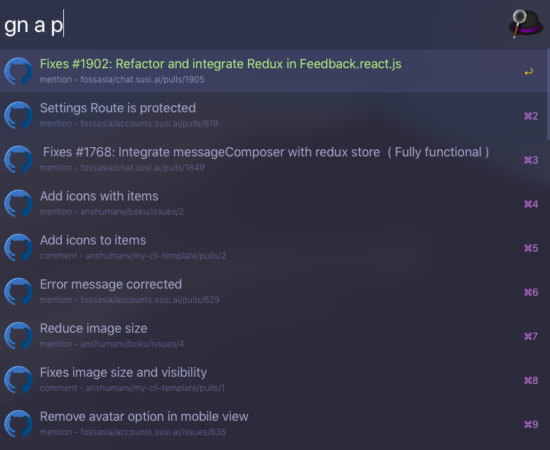

<p align="center">

</p>

<h1 align="center"> arvis-github-notifications </h1>
<p align="center">
</p>


<p align="center">Arvis workflow to fetch your github notifications.</p>


## Demo




## Install

```
$ npm install --global arvis-github-notifications
```


## Configuration

### Generate GitHub token

1. Create a new personal access token with notification access [here](https://github.com/settings/tokens/new).
2. Add description and click on genreate.
3. Click **copy**.

## Usage

In Arvis, type `gn` to display notifications.

Optional params - 

* a - Show notifications marked a read
* p - Show notifications in which you were directly mentioned or participated.


## Author

[Anshuman Verma](https://github.com/anshumanv)

[](https://twitter.com/Anshumaniac12)
[](https://linkedin.com/in/anshumanv12)
[](https://www.facebook.com/anshumanv12)
[](https://www.paypal.me/anshumanverma)

## 🔗 This workflow is converted from [alfred-workflow](https://github.com/anshumanv/alfred-github-notifications).

* Note that there might be some code change or different actions from the original workflow.

* Marked original workflow's creator to author.
